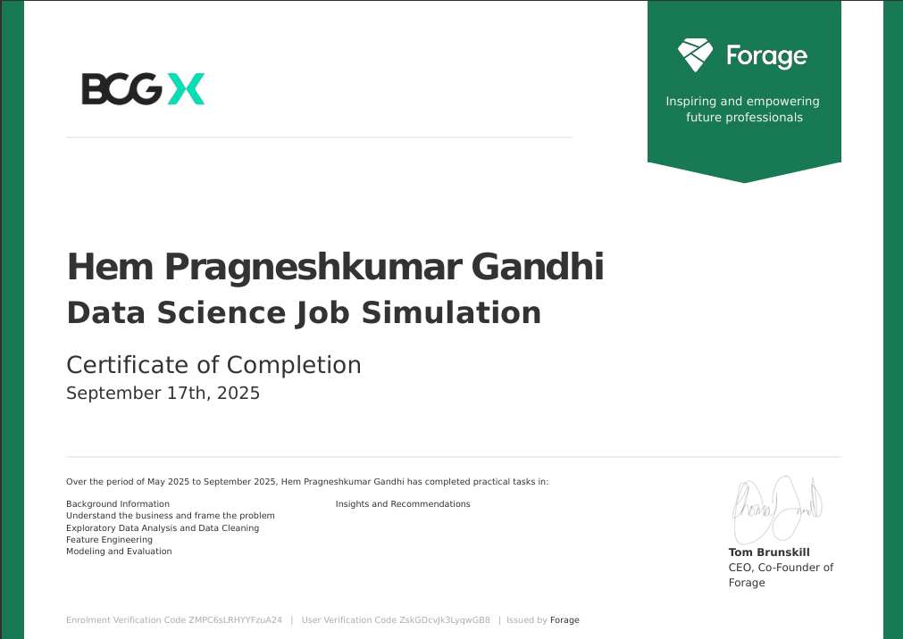

# ⚡ BCG X PowerCo Churn Analysis  
*Data Science Job Simulation – September 2025*  

---

  
  
  
  
  

---

## 🌐 Overview
This project simulates the role of a **Junior Data Scientist at BCG X**, working with the client **PowerCo** – a major gas & electricity utility.  
The goal: **analyze churn, build predictive models, and deliver business recommendations** to improve customer retention.  

---

## 🗂️ Repository Structure

📂 **assets/**  
  📄 certificate.png – Forage certificate   

📂 **notes/**  
  📄 **LEARNINGS.md** – Reflections & key skills gained  
  📄 **NOTES.md** – Detailed workflow documentation  

📂 **task_1_business_understanding/**  
  📄 task1.md – Business Understanding & Problem Framing  

📂 **task_2_eda/**  
  📂 data/ – Raw & cleaned data files  
  📂 notebooks/ – Jupyter notebooks for EDA  
  📄 task2.md – Exploratory Data Analysis & Data Cleaning  

📂 **task_3_feature_engineering/**  
  📂 data/ – Feature-engineered data  
  📂 notebooks/ – Notebooks for transformations  
  📄 task3.md – Feature Engineering summary  

📂 **task_4_modeling/**  
  📂 data/ – Model-ready datasets  
  📂 notebooks/ – Model training & evaluation notebooks  
  📄 task4.md – Modeling results  

📂 **task_5_executive_summary/**  
  📄 task5.md – Executive Summary deliverable  

📄 **intro.md** – Introduction to BCG X & PowerCo   
📄 **README.md** – Main landing page  

---

## 🔗 Quick Links
- [🌐 Intro – BCG X & PowerCo Context](intro.md)  
- [Task 1 – Business Understanding](task_1_business_understanding/task1.md)  
- [Task 2 – EDA & Data Cleaning](task_2_eda/task2.md)  
- [Task 3 – Feature Engineering](task_3_feature_engineering/task3.md)  
- [Task 4 – Modeling](task_4_modeling/task4.md)  
- [Task 5 – Executive Summary](task_5_executive_summary/task5.md)  
- [🎓 Learnings](notes/LEARNINGS.md)  
- [📝 Notes](notes/NOTES.md)  

---

## 📊 Workflow Highlights
- **Task 1 – Business Understanding** → Framed churn as a price sensitivity problem & outlined data needs.  
- **Task 2 – EDA** → Cleaned messy data, found churn rate ~10%, and identified sales channel & contract type as key drivers.  
- **Task 3 – Feature Engineering** → Applied log transforms, one-hot encoding, and date-derived features for model readiness.  
- **Task 4 – Modeling** → Built Logistic Regression, Decision Tree, and Random Forest; **Random Forest achieved ~50% recall**, the key business metric.  
- **Task 5 – Executive Summary** → Consolidated findings into a client-facing recommendation for PowerCo.  

---

## 📜 Certificate
*Forage – BCG X Data Science Job Simulation (Sept 2025)*  

  

---

## 👤 Author
**Hem Gandhi**  
- [LinkedIn](https://www.linkedin.com/in/hem-gandhi-92757b195/)  
- [GitHub](https://github.com/hemgandhi13)  

---

✨ *This repository demonstrates an end-to-end data science workflow — from business framing → EDA → feature engineering → modeling → executive recommendations — packaged in a recruiter-ready portfolio project.*

